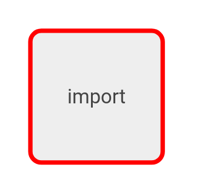
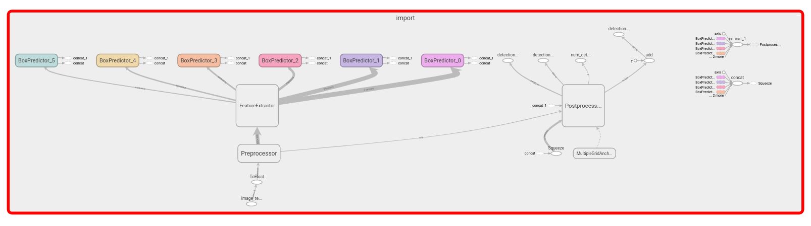
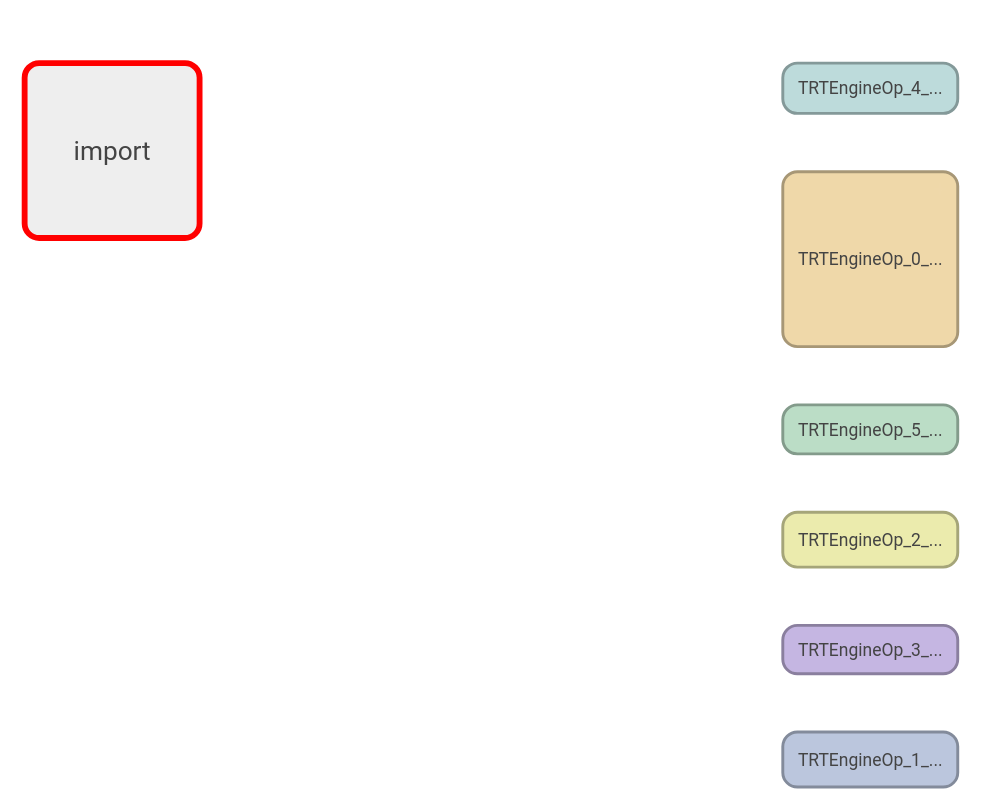
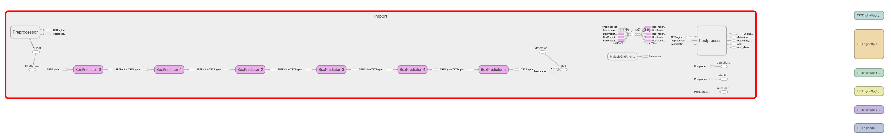

Native-TensorRT_TensorFlow-TensorRT
====

Provided Following Notebook

- TensorFlow-TensorRT
- Keras_TensorFlow-TensorRT
- Native-TensorRT

## Description

- TensorFlow-TensorRT
 - TensorFlow-TensorRT apply to Object Detection
  - Change following parameter
   - max_workspace_size_bytes
   - minimum_segment_size
   - is_dynamic_op
- Keras_TensorFlow-TensorRT
 - TensorFlow-TensorRT apply to classify(Keras)
  - Keras model convert to TensorFlow model
  - TensorFlow model convert to TensorFlow-TensorRT model
- Native-TensorRT
 - TensorFlow frozen graph

## Demo

TensorFlow-TensorRT apply

### Before TensorFlow-TensorRT




### After TensorFlow-TensorRT




## Requirement

### Standard Library install

```
sudo apt-get update
sudo apt-get install -y python3-pip
```

### Jtop install

```
sudo -H pip3 install jetson-stats
```

### Jupyter setting

```
sudo apt install -y nodejs npm
sudo pip3 install jupyterlab==1.0.4
```

### Library install

```
sudo apt-get install -y libhdf5-serial-dev hdf5-tools libhdf5-dev zlib1g-dev zip libjpeg8-dev python3-matplotlib
sudo pip3 install -U absl-py==0.7.1 astor==0.8.0 certifi==2019.6.16 chardet==3.0.4 gast==0.2.2 google-pasta==0.1.7 grpcio==1.22.0 h5py==2.9.0 idna==2.8 keras-applications==1.0.8 keras-preprocessing==1.1.0 mock==3.0.5 numpy==1.17.0 portpicker==1.3.1 protobuf==3.9.1 psutil==5.6.3 py-cpuinfo==5.0.0 requests==2.22.0 setuptools==41.0.1 six==1.12.0 termcolor==1.1.0 urllib3==1.25.3 wrapt==1.11.2 google-pasta==0.1.7
sudo pip3 install Pillow==6.1.0
```

### Deep Learning library install


#### TensorFlow

```
sudo pip3 install tensorflow-estimator==1.14.0 tensorboard==1.14.0
sudo pip3 install --extra-index-url https://developer.download.nvidia.com/compute/redist/jp/v42 tensorflow-gpu==1.14.0+nv19.7
```

#### Keras

```
sudo apt-get install -y libblas3 liblapack3 liblapack-dev libblas-dev gfortran
sudo pip3 install keras==2.2.4
```

#### PyTorch

```
sudo apt-get install -y libjpeg-dev zlib1g-dev
wget https://nvidia.box.com/shared/static/j2dn48btaxosqp0zremqqm8pjelriyvs.whl -O torch-1.1.0-cp36-cp36m-linux_aarch64.whl
sudo pip3 install torch-1.1.0-cp36-cp36m-linux_aarch64.whl
git clone -b v0.3.0 https://github.com/pytorch/vision torchvision
cd torchvision/ && sudo python3 setup.py install
```

#### Optional(Jetson Nano)

##### Use more Swap memory
```
git clone https://github.com/JetsonHacksNano/installSwapfile
cd installSwapfile && bash installSwapfile.sh
```

## Usage

```
chromium-browser --disable-gpu
jupyter-lab
```

## Reference

- [TensorFlow-TensorRT](https://docs.nvidia.com/deeplearning/frameworks/tf-trt-user-guide/index.html)
- [TensorFlow-TensorRT GTC](https://developer.nvidia.com/gtc/2019/video/S9431)
- [JetBot](https://github.com/NVIDIA-AI-IOT/jetbot)

## Licence

[MIT](https://github.com/tcnksm/tool/blob/master/LICENCE)

## Author

[SnowMasaya](https://github.com/SnowMasaya)